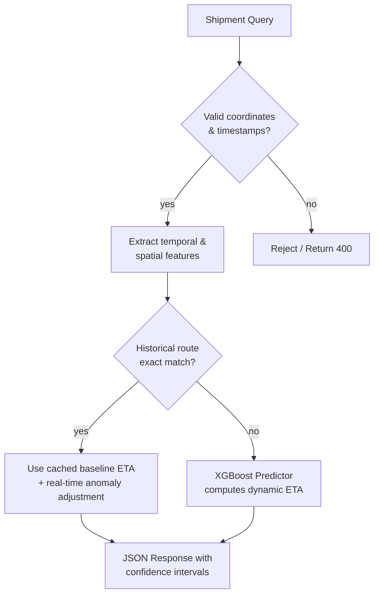

# *Logistic Intelligence API*

Predictive routing and delivery time estimation over supply chain logistics data, served through a FastAPI application. The core engine utilizes an XGBoost regressor for dynamic ETA prediction with a fallback heuristic network graph, ensuring a robust response even for unmapped or entirely new delivery routes.

[](https://logistic-intelligence.onrender.com)


## *How prediction works*



`api/inference.py` is the actual source of truth for this - its module docstring walks through why each routing tier exists and what it hands off to the next. The short version: tier 1 (historical route matching) handles frequent, high-volume paths to save compute, while tier 2 handles novel routes by passing spatial and temporal features (weather, traffic index, time of day) through the pre-trained XGBoost model. 

Data pipeline cleaning and the model training both happen offline, in `notebooks/ETA_Prediction_Model_Training.ipynb` plus the versioning documented in `models/README.md`. The API loads the resulting model weights once at startup, meaning every request after that is a rapid inference computation without any data loading overhead.

## *Project structure*

```text
logistic-intelligence-api/
├── api/
│   ├── main.py           # FastAPI routes and config
│   ├── inference.py      # DeliveryPredictor: route matching and ETA calculation
│   └── features.py       # Shared spatial/temporal data transformations
├── models/
│   ├── xgboost_eta_v2.json
│   ├── route_graph.pkl
│   ├── scaler.pkl
│   └── README.md
├── tests/                # Pytest unit and integration tests
├── notebooks/
│   └── ETA_Prediction_Model_Training.ipynb
├── requirements.txt
├── render.yaml
└── LICENSE
```

## *Running locally*

```bash
python -m venv venv
source venv/bin/activate          # venv\Scripts\activate on Windows
pip install -r requirements.txt
uvicorn api.main:app --reload
```

Visit `http://127.0.0.1:8000/docs` for the interactive Swagger UI.

## *Deploying to Render*

1. Push this repository to GitHub.
2. In the Render dashboard, choose **New > Blueprint** and point it at the repo - Render reads `render.yaml` and provisions the service automatically (free plan, health check on `/health`).
3. Configuring by hand instead: **New > Web Service**, build command `pip install -r requirements.txt`, start command `uvicorn api.main:app --host 0.0.0.0 --port 10000`.
4. Wait for the build to finish, then open the assigned `onrender.com` URL.

Render's free instances spin down after periods of inactivity, so the first API request after a quiet stretch takes a few extra seconds to wake up the service and load the model into memory.

## *Tech stack*

FastAPI · XGBoost (ETA inference) · scikit-learn (Feature scaling) · NetworkX · pandas · uvicorn · Render

## *Author*

**Abhishek Grover**
[Portfolio](https://abhishekgroverai.netlify.app) ·
[GitHub](https://github.com/AbhishekGrover1) ·
[LinkedIn](https://www.linkedin.com/in/abhishek-grover07)

## *License*

MIT - see [LICENSE](LICENSE).
